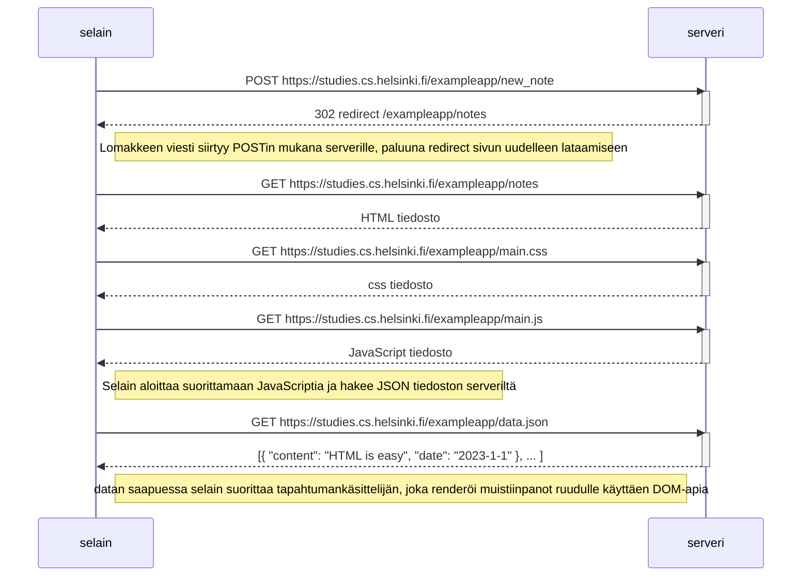
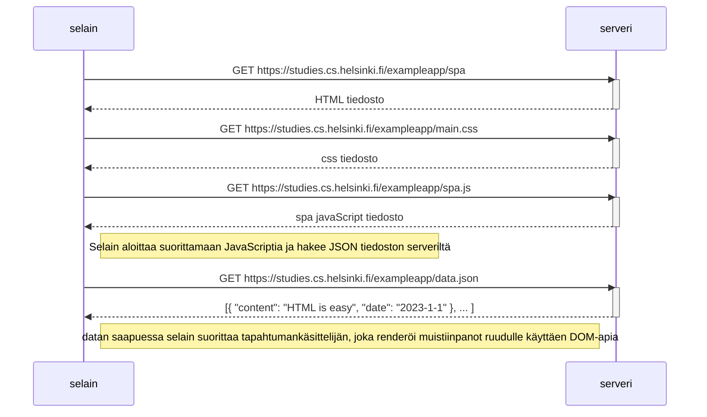
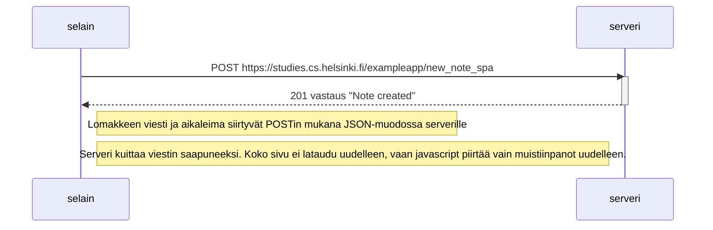

0.4: Uusi muistiinpano

0.5: Single Page App

0.6: Uusi muistiinpano

Lisätään vielä viimeiseen tehtävään, että koodin perusteella ymmärsin noten kirjoitettavan sivulle uudelleen riippumatta siitä mitä serverin puolella tapahtuu:
Ensin lisätään note, piirretään lista uudelleen, ja vasta sen jälkeen tapahtuu "sendToServer", enkä näe mitään yhteyttä että serverin tapahtumat enää vaikuttaisivat käyttäjälle uuden noten tulostumiseen.
Oikeastaan siis note kirjoitetaan uudelleen käyttäjän näytölle ennen kuin nuoli edes lähtee serverin suuntaan. 

